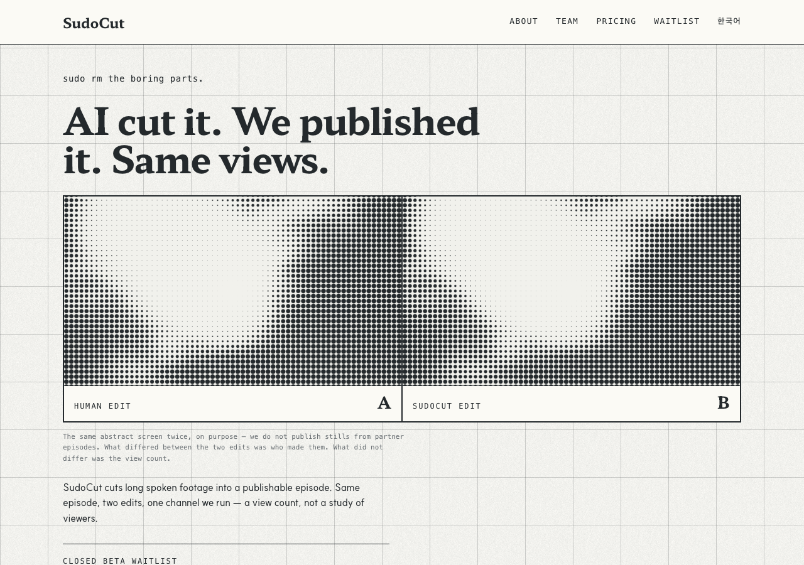

# r5 · AB — the layout is the argument



Two screens side by side, one rule between them, labelled `Human edit` and
`SudoCut edit`. They are identical, because that is the claim — a visitor gets
the point before reading a word.

**Both panels screen the same file on purpose, and the page says so.** Two
different frames would have implied the two edits look different, which is a
claim nobody made and nobody measured; and a still from either real edit belongs
to the channel, not to us. The divider is a gap over an ink background rather
than a border, so the two tracks are exactly equal and the screens land in
phase — this variant should survive someone looking closely.

**The risk:** it spends the hero on a comparison a first-time visitor has no
reason to trust yet.

**Screen:** 16px, two matched panels, 16:9
**Trust band:** under the hero, 168px tiles at a 7px pitch

## Try it

```bash
git checkout r5-ab && pnpm install && pnpm dev   # http://localhost:3000/en
```

## Shared with every r5 variant

Same copy, same components, same constitution amendments — only the layout
differs, which is what makes the six comparable. See `design/rounds/r5/BRIEF.md`.

- Hero is one claim: **"AI cut it. We published it. Same views."** The r4 lede
  drops from 60 words to 28, and the A/B proof card is gone — the headline is
  the proof, and keeping both said it twice.
- `<Halftone>` — constitution D7. Ink on paper, never cobalt, static, measured.
- `<ChannelTicker>` — constitution D8. Five real channel names; the pictures are
  abstract, and the band says so.
- One cobalt object: the waitlist button.
