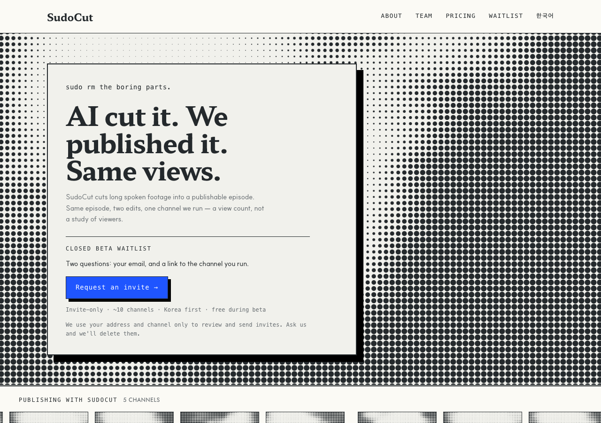

# r5 · BANDS — three passes through the press



Aggressive by repetition rather than by scale. Three full-bleed screened bands at
three different pitches — 26px, the trust band's 7px, then 11px — separated by
strips of bare paper, with content knocked out on paper plates.

**Why it is not one full-page screen:** that is banned, by the same rule that
lets the rest of this exist. D7 admits the shader as a *foreground* object and
leaves the page's background field to warm paper, the D6 texture and the 76px
grid. Bands give an all-over effect without taking the sheet away.

**The risk:** three bands is three chances to bury the claim, and the figures
band now competes with the hero for the same visual weight.

**Screen:** 26px hero, 11px figures — plus the band's own 7px
**Trust band:** the middle of the three bands, 168px tiles at a 7px pitch

## Try it

```bash
git checkout r5-bands && pnpm install && pnpm dev   # http://localhost:3000/en
```

## Shared with every r5 variant

Same copy, same components, same constitution amendments — only the layout
differs, which is what makes the six comparable. See `design/rounds/r5/BRIEF.md`.

- Hero is one claim: **"AI cut it. We published it. Same views."** The r4 lede
  drops from 60 words to 28, and the A/B proof card is gone — the headline is
  the proof, and keeping both said it twice.
- `<Halftone>` — constitution D7. Ink on paper, never cobalt, static, measured.
- `<ChannelTicker>` — constitution D8. Five real channel names; the pictures are
  abstract, and the band says so.
- One cobalt object: the waitlist button.
