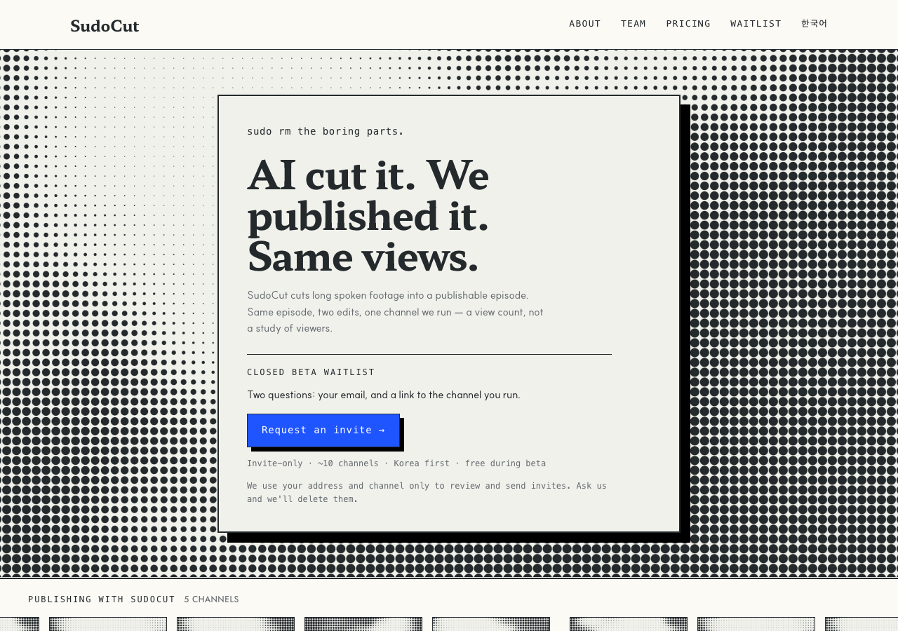

# r5 · BILLBOARD — the screen is the hero



The most literal reading of *use it aggressively*. A full-bleed screen at a 28px
cell pitch — near the top of D7's band, dots you can count from across a room —
with the claim knocked out on a plate of warm paper and a 14px hard offset.

**The bet:** contrast. Everything is texture except the one sentence that has to
be read.

**The risk, stated rather than hidden:** a field of ink this large is the closest
any variant comes to r2's rejected failure, where a dark rectangle read as a
foreign object on a warm sheet. It measures inside the band; whether it is right
for a landing page is a different question and a founder's to answer.

**Screen:** 28px full-bleed field behind the whole hero
**Trust band:** immediately under the hero band, 168px tiles at a 7px pitch

## Try it

```bash
git checkout r5-billboard && pnpm install && pnpm dev   # http://localhost:3000/en
```

## Shared with every r5 variant

Same copy, same components, same constitution amendments — only the layout
differs, which is what makes the six comparable. See `design/rounds/r5/BRIEF.md`.

- Hero is one claim: **"AI cut it. We published it. Same views."** The r4 lede
  drops from 60 words to 28, and the A/B proof card is gone — the headline is
  the proof, and keeping both said it twice.
- `<Halftone>` — constitution D7. Ink on paper, never cobalt, static, measured.
- `<ChannelTicker>` — constitution D8. Five real channel names; the pictures are
  abstract, and the band says so.
- One cobalt object: the waitlist button.
