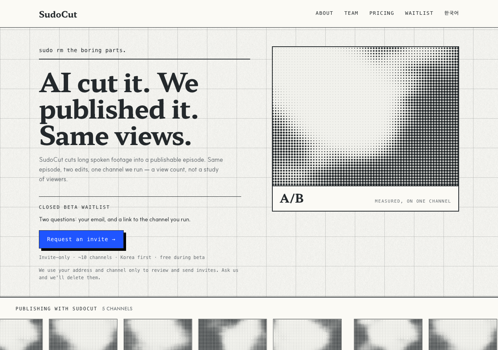

# r5 · PRESS — the newspaper front page



Type carries the page and the screen is the picture beside the story, the way a
broadsheet sets a lead. The kicker gets a dateline rule; the plate gets a caption
strip with the `A/B` mark and the measurement qualifier.

**The bet:** the claim is strong enough to be read as words, and the screen's job
is to make the page look printed rather than to make the argument.

**The risk:** it is the most conservative of the six. If the founder's note meant
*make it feel different*, this may read as r4 with a picture added.

**Screen:** 14px plate, 4:3, beside the headline
**Trust band:** directly under the hero, 176px tiles at a 7px pitch — the hero is built tight so the band clears the fold at 1280x800

## Try it

```bash
git checkout r5-press && pnpm install && pnpm dev   # http://localhost:3000/en
```

## Shared with every r5 variant

Same copy, same components, same constitution amendments — only the layout
differs, which is what makes the six comparable. See `design/rounds/r5/BRIEF.md`.

- Hero is one claim: **"AI cut it. We published it. Same views."** The r4 lede
  drops from 60 words to 28, and the A/B proof card is gone — the headline is
  the proof, and keeping both said it twice.
- `<Halftone>` — constitution D7. Ink on paper, never cobalt, static, measured.
- `<ChannelTicker>` — constitution D8. Five real channel names; the pictures are
  abstract, and the band says so.
- One cobalt object: the waitlist button.
