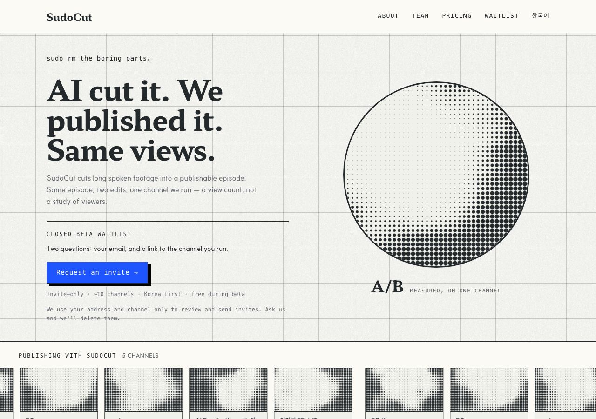

# r5 · STAMP — one screened disc



A single screened circle, printed on the sheet like a proof stamp, claim beside
it. W4 bans rounded corners but excepts `50%`, so a disc is the one round shape
the system allows — and the only object in this round that reads as a mark rather
than as another panel.

**The bet:** every other variant is rectangles inside rectangles. That is the
house grammar and also its rut.

**The risk:** a stamp says *approved*, and what we have is one view count on one
channel. The caption under the disc carries the whole qualification, and a
caption is a weak place to put the honesty.

**Screen:** 20px, a 400px disc clipped to 50%
**Trust band:** under the hero, 168px tiles at a 7px pitch

## Try it

```bash
git checkout r5-stamp && pnpm install && pnpm dev   # http://localhost:3000/en
```

## Shared with every r5 variant

Same copy, same components, same constitution amendments — only the layout
differs, which is what makes the six comparable. See `design/rounds/r5/BRIEF.md`.

- Hero is one claim: **"AI cut it. We published it. Same views."** The r4 lede
  drops from 60 words to 28, and the A/B proof card is gone — the headline is
  the proof, and keeping both said it twice.
- `<Halftone>` — constitution D7. Ink on paper, never cobalt, static, measured.
- `<ChannelTicker>` — constitution D8. Five real channel names; the pictures are
  abstract, and the band says so.
- One cobalt object: the waitlist button.
