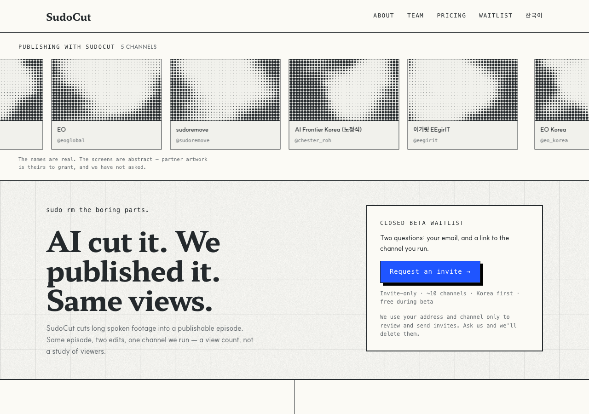

# r5 · TICKER — the trust band is the hero



The only variant that answers *"shown to users at once they landed"* by putting
the band **first** — above the headline, under the masthead, at the largest tile
size in the round. Nothing about the fold can go wrong, because the band is not
below it.

**The bet:** recognition beats explanation. Five channel names do the work a
paragraph would.

**The risk, and it is the reason this is one of six rather than the answer:** it
spends the most valuable strip on the page on proof-by-association. That works
only if the visitor already knows the names. On a Korean launch three of them
land; on an English one, possibly none.

**Screen:** 12px, 240px tiles — the largest screens in the round
**Trust band:** first thing on the page, above the headline

## Try it

```bash
git checkout r5-ticker && pnpm install && pnpm dev   # http://localhost:3000/en
```

## Shared with every r5 variant

Same copy, same components, same constitution amendments — only the layout
differs, which is what makes the six comparable. See `design/rounds/r5/BRIEF.md`.

- Hero is one claim: **"AI cut it. We published it. Same views."** The r4 lede
  drops from 60 words to 28, and the A/B proof card is gone — the headline is
  the proof, and keeping both said it twice.
- `<Halftone>` — constitution D7. Ink on paper, never cobalt, static, measured.
- `<ChannelTicker>` — constitution D8. Five real channel names; the pictures are
  abstract, and the band says so.
- One cobalt object: the waitlist button.
