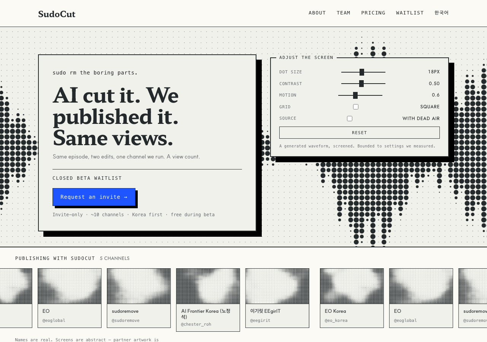

# r6 · CONSOLE — the controls are the feature



Every parameter the visitor is allowed to touch is on the page, boxed beside the
claim with the same 2px border and hard shadow as the plate, so it reads as a
second printed object rather than as chrome.

The argument is not novelty. soul.md S7 is *expose the criteria — reviewable,
never a black box*, and it is the same instinct that puts every cut on an editable
timeline. A front page that hands over its own controls makes that argument in the
only way a landing page can.

**The risk, and it is the sharpest in the round:** five controls beside a
three-sentence claim is a lot of interface for a page whose brief was *too much
text*. Interface is text.

**Motion:** slow drift
**Controls:** **all five** — dot size, contrast, motion, grid, source
**Screen:** 18px, waveform

## Try it — and you have to, for this round

```bash
git checkout r6-console && pnpm install && pnpm dev   # http://localhost:3000/en
```

**The preview above is a pinned frame, not the design.** Headless Chrome fires
`requestAnimationFrame` exactly once under `--virtual-time-budget` — measured, one
frame per virtual second — so an unpinned screenshot of an animated page is always
frame zero and looks identical to a page that does not move. `?sc-frame=<seconds>`
draws one deterministic frame instead, which is what these previews are. A
screenshot cannot show you motion.

## Shared with every r6 variant

Built on `r5-billboard`, the only r5 variant kept
(`design/rounds/r5/VERDICT.md`). Same copy, same components, same constitution —
only the motion and the console differ, which is what makes the six comparable.

- **The screen moves** (D9) and **the visitor can change it** (D10), inside ranges
  that measured inside D7's band.
- **The base image is a waveform** — what SudoCut actually looks at — plus the
  same signal with its dead air removed, 26.2% of it.
- **71 words of copy**, down from r5's ~180. The privacy line moved to the footer
  rather than being deleted.
- One cobalt object: the waitlist button. The console is monochrome.

### `u_time` is dead in this shader

It is declared and never read. `speed: 1` renders byte-identical frames at 0, 2000
and 8000 while a `u_size` change does not — so the motion is driven from our own
loop over uniforms the shader actually reads. Full detail in constitution D9.
