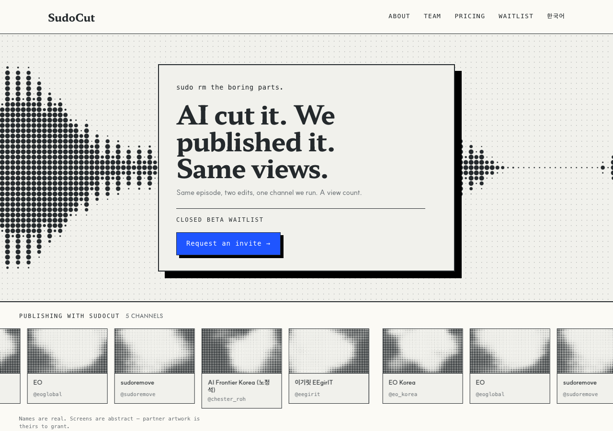

# r6 · PLAYHEAD — the tape is running



The screen pans steadily across the waveform and then cuts back to the start.
O4 says the brand never dissolves, so the loop point is a hard cut rather than an
ease back — it reads as a playhead crossing audio, which is what the product does
to a recording.

**The bet:** motion that means something. The page is not decorated, it is
running.
**The risk:** a pan is the most conventional thing a background can do, and at
this pitch the movement may read as drift rather than as transport.

**Motion:** pans across the waveform, then **hard resets**
**Controls:** dot size, speed
**Screen:** 22px, waveform

## Try it — and you have to, for this round

```bash
git checkout r6-playhead && pnpm install && pnpm dev   # http://localhost:3000/en
```

**The preview above is a pinned frame, not the design.** Headless Chrome fires
`requestAnimationFrame` exactly once under `--virtual-time-budget` — measured, one
frame per virtual second — so an unpinned screenshot of an animated page is always
frame zero and looks identical to a page that does not move. `?sc-frame=<seconds>`
draws one deterministic frame instead, which is what these previews are. A
screenshot cannot show you motion.

## Shared with every r6 variant

Built on `r5-billboard`, the only r5 variant kept
(`design/rounds/r5/VERDICT.md`). Same copy, same components, same constitution —
only the motion and the console differ, which is what makes the six comparable.

- **The screen moves** (D9) and **the visitor can change it** (D10), inside ranges
  that measured inside D7's band.
- **The base image is a waveform** — what SudoCut actually looks at — plus the
  same signal with its dead air removed, 26.2% of it.
- **71 words of copy**, down from r5's ~180. The privacy line moved to the footer
  rather than being deleted.
- One cobalt object: the waitlist button. The console is monochrome.

### `u_time` is dead in this shader

It is declared and never read. `speed: 1` renders byte-identical frames at 0, 2000
and 8000 while a `u_size` change does not — so the motion is driven from our own
loop over uniforms the shader actually reads. Full detail in constitution D9.
