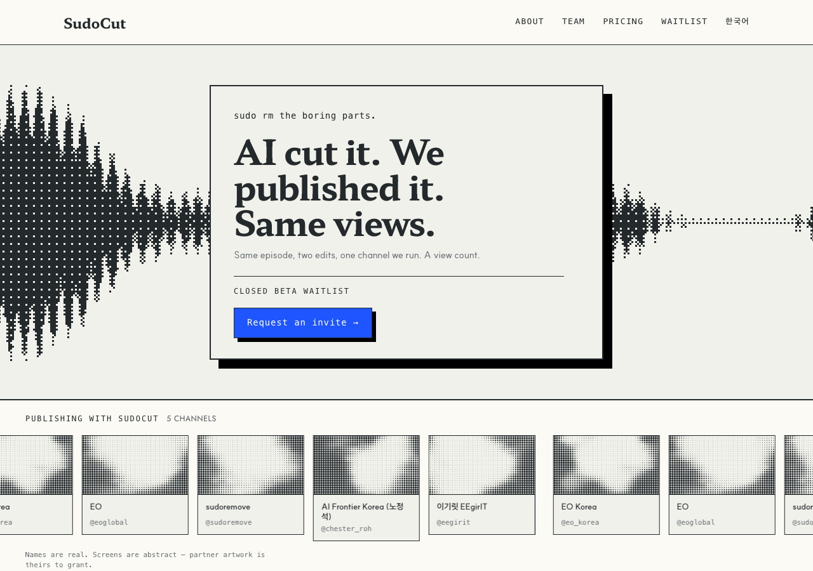

# r7 · DITHER — the recommendation



An 8×8 Bayer dither of the waveform, ink on paper, panning seamlessly.

**Why it beats the incumbent, measured rather than argued:** `halftone-dots`
reduces the signal to round dots on a fixed grid, and the waveform's fine vertical
peaks are exactly the detail a dot grid throws away. The dither keeps them —
**coverage 0.321 against halftone's 0.210 on the same source**, so it is carrying
more of the picture rather than simply printing darker.

Two-colour by construction: `u_colorHighlight` is set equal to `u_colorFront`,
which the library's own docs call *classic 2-color dithering*.

**Shader:** `image-dithering` · **Base image:** waveform · **Coverage:** 0.321

## Try it

```bash
git checkout r7-dither && pnpm install && pnpm dev   # http://localhost:3000/en
```

**The preview is a pinned frame, not the design.** Headless Chrome fires
`requestAnimationFrame` exactly once under `--virtual-time-budget`, so no
screenshot can show motion — or the absence of a seam.

## What this round is testing

**Only the screen differs across all six variants.** The layout is `r6-playhead`
unchanged, because the founder asked whether `halftone-dots` was the right shader
at all, and a round that also moved the layout could not answer that.

Three variants hold the shader and change the base image; two change the shader;
one changes nothing and is the control. That split separates *which shader* from
*which picture*.

Every candidate was rendered and measured before being proposed —
`node tools/shader-survey.mjs`, table in constitution **D11**. Most of the library
never reached the page: `mesh-gradient`, `god-rays`, `metaballs`, `liquid-metal`,
`warp`, `voronoi` and the rest blend many colours or glow, and W5 bans blur while
W8 bans decorative gradients. Not taste rejections — they cannot be expressed in a
three-colour palette.

## The base images

Three, all **periodic across their width**, so any pan loops with no seam. All
built from one speech envelope, so they are three views of the same recording
rather than three unrelated pictures. None is footage or anyone's episode.
