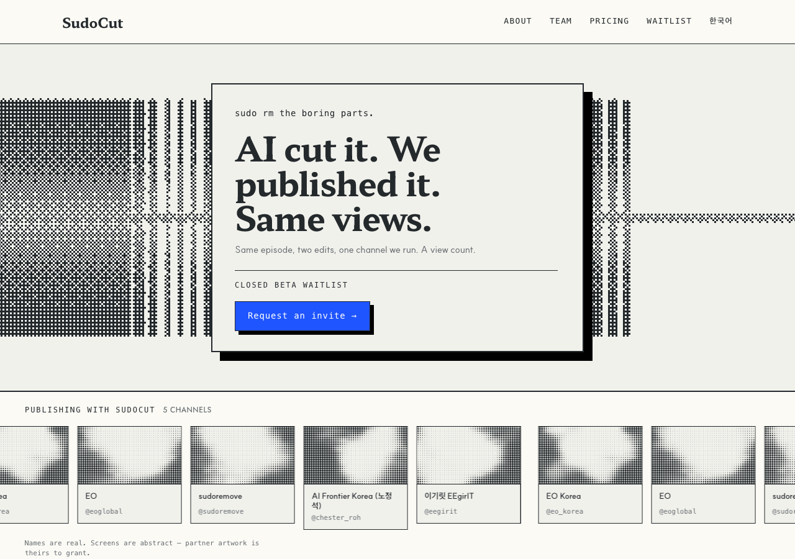

# r7 · TIMELINE — the most literal picture



The same dither on a timeline: clips laid end to end with the cuts between them.
Kept takes as solid bands, removed dead air as the gaps — the most literal picture
of the product in the set, and blocky in the house grammar.

**The risk is ink.** At 0.458 it is the heaviest screen in the round and close to
the 0.5 flood line. A field this dark on a warm sheet is walking back toward the
object the founder rejected in r2.

**Shader:** `image-dithering` · **Base image:** timeline · **Coverage:** 0.458

## Try it

```bash
git checkout r7-timeline && pnpm install && pnpm dev   # http://localhost:3000/en
```

**The preview is a pinned frame, not the design.** Headless Chrome fires
`requestAnimationFrame` exactly once under `--virtual-time-budget`, so no
screenshot can show motion — or the absence of a seam.

## What this round is testing

**Only the screen differs across all six variants.** The layout is `r6-playhead`
unchanged, because the founder asked whether `halftone-dots` was the right shader
at all, and a round that also moved the layout could not answer that.

Three variants hold the shader and change the base image; two change the shader;
one changes nothing and is the control. That split separates *which shader* from
*which picture*.

Every candidate was rendered and measured before being proposed —
`node tools/shader-survey.mjs`, table in constitution **D11**. Most of the library
never reached the page: `mesh-gradient`, `god-rays`, `metaballs`, `liquid-metal`,
`warp`, `voronoi` and the rest blend many colours or glow, and W5 bans blur while
W8 bans decorative gradients. Not taste rejections — they cannot be expressed in a
three-colour palette.

## The base images

Three, all **periodic across their width**, so any pan loops with no seam. All
built from one speech envelope, so they are three views of the same recording
rather than three unrelated pictures. None is footage or anyone's episode.
